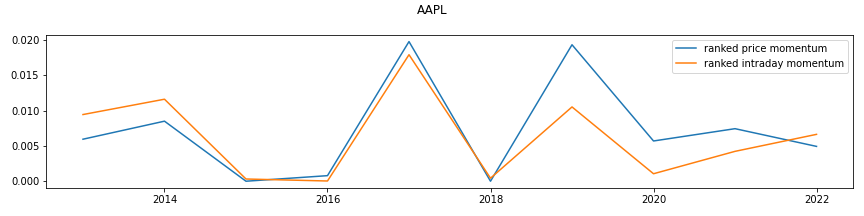
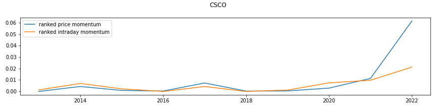
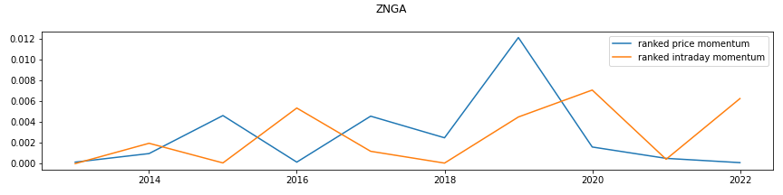

# Hanwha Financial Network 2022 - Global Internship Program
## Younghun Lee

### 1. Rank price momentum(Q2_result.csv)
- The score is a strategy that yields the score based on the highest peak in last 252 trading days.
- 전고점 대비 현재 종가의 위치를 나타낸다.
-  
- Pros:
  - It is easy to find out whehter the stock is going to peak or not.
- Cons:
  - The score does not recognize whether the current state is moving downward or upward, especially for the stock that shows cyclical movements.

### 2. Rank Intraday momentum(Q3_result.csv)
-  Rank based on how much a price rose from open to close compared to its movement toward the day.
- 일간 상승분(Close-Open)을 일간 진폭(High-Low)로 나눈 값을, 1년치의 window에서 순위를 매긴다. Rank 방법은 1.과 동일하게 진행하였다.
-  

- Pros:
  - The score captures the momentum when the stock price increases without much intraday fluctuations.
  - For example, when the stock price surge based on fundamental events (earning sock or news related to M&A), the price will increase consecutive days without intraday downward movements.
- Cons:
  - Because of an impact of mean reversion, there's a probability that higher the score, the stock price will decrease.
  - If the stock have small daily increment as well as small daily difference between High and Low, the score will be high but this case is irrelevant to momentum.

### 3. R-squared Comparison

1. Methodology
   1. Execute OLS with 1 year window
   2. Return R-squared value
   3. plot by each stock
2. Result
   1. Overall two strategies show similar predictive power
   2. However, the first strategy showed bettwer result in recent years (2021, 2022)
